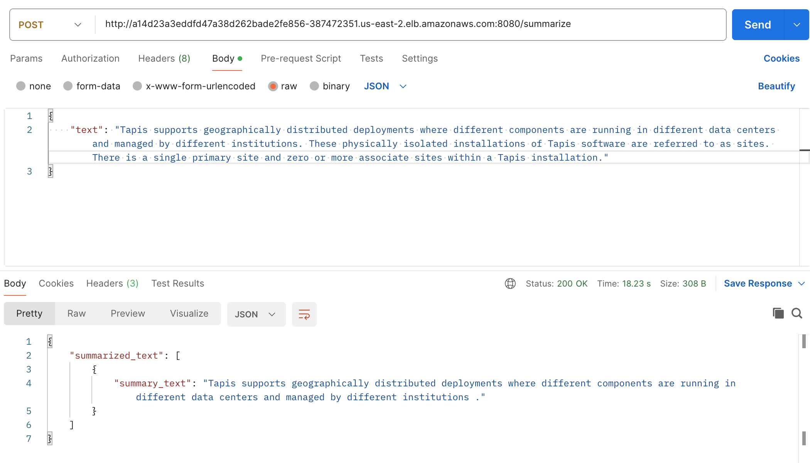
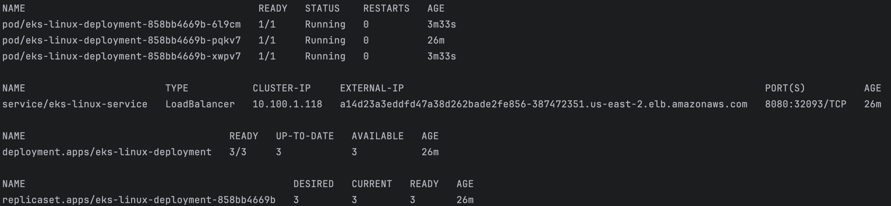

# LLMOps - Model Serving with Rust

> IDS 721 Spring 2024 Final Project
> By Team 24
> Members: Zeyu Yuan, Shanghui Yin, Yang Ouyang, Guowang Zeng

## Demo Video

Here is our demo video: https://youtu.be/PdiYhbwhc2M

## Prerequisites

Ensure the following software is installed:

- Rust environment (including Cargo)
- Actix-web
- Python 3.9
- AWS CLI
- AWS ECR
- AWS EKS
- AWS IAM
- Docker, Docker Hub
- kubectl with Kubernetes cluster connection configured
- eksctl
- Github Actions
- HuggingFace transformers
- Helm CLI 3.0 or later
- a Linux or macOS computer to perform the steps in the following sections


## Requirements:

## Obtain Open Source ML Model: 

Select and acquire an open-source machine learning model suitable for serving. The model should be capable of providing inferences based on input data it receives. Based on the requirements, we decided to use `Falconsai/text_summarization` from HuggingFace.

Due to the nature of HuggingFace's transformers and pipeline, we decided to use python as model

## Create Rust Web Service for Model Inferences: 

Develop a web service in Rust that can serve the ML model's inferences. The service should be robust, efficiently handling requests and providing accurate responses from the model.

## Containerize Service and Deploy to Kubernetes: 

Containerize the Rust web service using Docker, ensuring it's well-prepared for deployment. Subsequently, deploy the containerized service to a Kubernetes cluster, configuring it for scalability and reliability.

Build the Rust web service into a Docker container, ensuring it's well-prepared for deployment. Subsequently, deploy the containerized service to a Kubernetes cluster, configuring it for scalability and reliability.


### Build the docker file
```bash
 docker build -t test-ecr .
```

### Run the docker container
```bash
docker run -p 8080:8080 test-ecr
```

### Test the service
```bash
curl -X POST http://localhost:8080/summarize -H "Content-Type: application/json" -d '{"text": "Many companies have outsourced their hiring processes to recruitment process outsourcers, which often use subcontractors, particularly in India and the Philippines, to find potential candidates. The essay also mentions the use of digital tracking to identify potential candidates."}'

## Response 
{
  "summary_text": "Many companies outsource their hiring processes to recruitment process outsourcers."
}
```



### Push the docker image to ECR
```bash
aws ecr get-login-password --region us-east-1 | docker login --username AWS --password-stdin 123456789012.dkr.ecr.us-east-1.amazonaws.com
docker tag test-ecr:latest 123456789012.dkr.ecr.us-east-1.amazonaws.com/test-ecr:latest
docker push 123456789012.dkr.ecr.us-east-1.amazonaws.com/test-ecr:latest
```

### Deploy the docker image to EKS

#### Pre-requisites
- install eksctl
- install kubectl
- install awscli

#### Create EKS cluster
```bash
eksctl create cluster --name test-eks --region us-east-2
```


```bash
kubectl create namespace eks-app
kubectl apply -f eks-deployment.yaml
kubectl apply -f eks-service.yaml
```



### Test the service by using Postman


## Implement CI/CD Pipeline: 

A github `cicd.yml` file is included in the repository. The pipeline is configured to build the Rust web service, containerize it, and deploy it to a Kubernetes cluster. The pipeline should be triggered automatically upon pushing changes to the repository. It has features such as environment variables, jobs, and triggers:
### Triggers:
- `push`: The workflow is triggered on a push to the main branch.
- `pull_request`: The workflow is also triggered on pull requests to the main branch.
### Environment Variables:
- Sets up several environment variables such as ECR_REPOSITORY, EKS_CLUSTER_NAME, and AWS_REGION which are used throughout the workflow.
### Jobs:
- `build`:
    - Runs on an Ubuntu latest virtual machine.
    - Uses Docker's dind (Docker in Docker) service to build a Docker image.
    - Logs into DockerHub and pushes a Docker image tagged as idsfinal.
- `test`:
    - Depends on the build job.
    - Uses a Rust environment for testing.
    - Sets up Python and installs dependencies.
    - Runs Rust tests specified by the command cargo test.
- `deploy`:
    - Depends on the test job.
    - Uses actions to configure AWS credentials, log into Amazon ECR, and push the Docker image to AWS's ECR.
    - Updates Kubernetes configuration to connect to an Amazon EKS cluster.
    - Deploys to the Amazon EKS cluster using Kubernetes deployment and service configuration files specified in eks-deployment.yaml and eks-service.yaml.

## Monitoring and Metrics

Amazon Managed Service for Prometheus supports ingesting metrics from Prometheus servers in clusters running Amazon EKS and in self-managed Kubernetes clusters running on Amazon EC2. The detailed instructions in this section are for a Prometheus server in an Amazon EKS cluster. The steps for a self-managed Kubernetes cluster on Amazon EC2 are the same, except that you will need to set up the OIDC provider and IAM roles for service accounts yourself in the Kubernetes cluster.

### Step 1: Add new Helm chart repositories

To add new Helm chart repositories, enter the following commands. For more information about these commands, see Helm Repo.

```bash
helm repo add prometheus-community https://prometheus-community.github.io/helm-charts
helm repo add kube-state-metrics https://kubernetes.github.io/kube-state-metrics
helm repo update
```

## Create a Prometheus namespace

```
kubectl create namespace prometheus-agent-namespace
```

## Step 3: Set up the new server and start ingesting metrics

Use a text editor to create a file named my_prometheus_values_yaml with the following content.

Replace IAM_PROXY_PROMETHEUS_ROLE_ARN with the ARN of the amp-iamproxy-ingest-role that you created in Set up service roles for the ingestion of metrics from Amazon EKS clusters.

Replace WORKSPACE_ID with the ID of your Amazon Managed Service for Prometheus workspace.

Replace REGION with the Region of your Amazon Managed Service for Prometheus workspace.

```yaml
## The following is a set of default values for prometheus server helm chart which enable remoteWrite to AMP
## For the rest of prometheus helm chart values see: https://github.com/prometheus-community/helm-charts/blob/main/charts/prometheus/values.yaml
##
serviceAccounts:
  server:
    name: amp-iamproxy-ingest-service-account
    annotations: 
      eks.amazonaws.com/role-arn: ${IAM_PROXY_PROMETHEUS_ROLE_ARN}
server:
  remoteWrite:
    - url: https://aps-workspaces.${REGION}.amazonaws.com/workspaces/${WORKSPACE_ID}/api/v1/remote_write
      sigv4:
        region: ${REGION}
      queue_config:
        max_samples_per_send: 1000
        max_shards: 200
        capacity: 2500
```

Enter the following command to create the Prometheus server.

Replace prometheus-chart-name with your Prometheus release name.

Replace prometheus-agent-namespace with the name of your Prometheus namespace.

```bash
helm install prometheus-chart-name prometheus-community/prometheus -n prometheus-agent-namespace \
-f my_prometheus_values_yaml
```

> The Prometheus server is now set up to ingest metrics from the Amazon EKS cluster.


## References
1. https://docs.aws.amazon.com/prometheus/latest/userguide/AMP-onboard-ingest-metrics.html
2. https://docs.aws.amazon.com/zh_cn/eks/latest/userguide/cluster-insights.html
3. https://kubernetes.io/docs/concepts/services-networking/service/#loadbalancer
4. https://docs.aws.amazon.com/zh_cn/eks/latest/userguide/sample-deployment.html